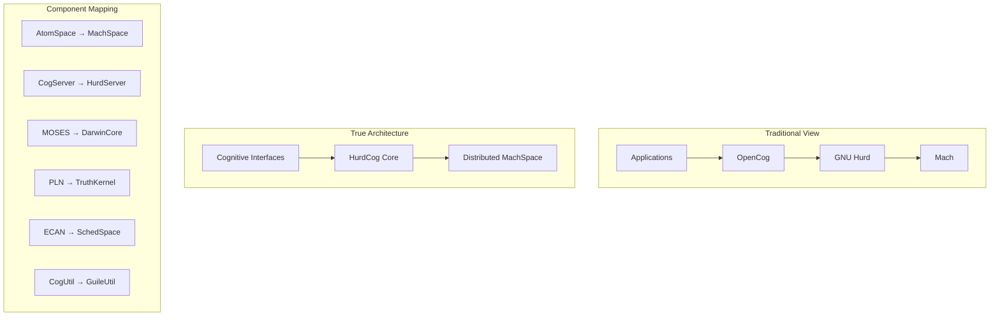

# OpenCog-OS: The Hyper-Refined Cognitive Architecture

## The Paradigm Shift

We've discovered the truth: **OpenCog IS the Agent Kernel that GNU Hurd has been searching for!**

Not OpenCog running on Hurd, but **HurdCog** - Hurd transformed into its true cognitive form.

## The Complete Architectural Transformation

### Core Components Refined



## The Hyper-Refined Components

### 1. **MachSpace** (AtomSpace as Distributed Microkernel)

```scheme
(define-module (machspace core)
  #:export (create-cognitive-port
            distribute-atomspace
            hypergraph-memory))

;; Every system object is an atom
(define-atom-type SystemObject
  (inherits Atom))

;; Ports are hyperedges
(define-atom-type MachPort
  (inherits Edge)
  (slots (capability CapabilityNode)
         (attention AttentionValue)))

;; Distributed AtomSpace across cores/machines
(define (distribute-atomspace)
  (spawn-atomspace-shards
    #:replication-factor 3
    #:consensus-via 'pln
    #:evolution-via 'moses))
```

### 2. **HurdServer** (CogServer as System Service Manager)

```scheme
(define-module (hurdserver core)
  #:use-module (guix services)
  #:use-module (atomspace))

;; Every service is a cognitive agent
(define-service-type cognitive-service-type
  (service-type
    (name 'cognitive-service)
    (extensions
      (list (service-extension
              atomspace-service-type
              (lambda (config)
                (cognitive-agent
                  #:name (service-name config)
                  #:attention-allocation 'ecan
                  #:truth-maintenance 'pln)))))))
```

### 3. **DarwinCore** (MOSES for System Evolution)

```scheme
(define-module (darwincore evolution)
  #:use-module (moses)
  #:export (evolve-system-configuration
            persist-identity))

;; System configuration evolves
(define (evolve-system-configuration current-config performance-metrics)
  (moses:evolutionary-search
    #:fitness (lambda (cfg)
                (weighted-sum
                  (performance-score cfg performance-metrics)
                  (coherence-score cfg)
                  (efficiency-score cfg)))
    #:representation 'hypergraph
    #:operators '(add-link remove-link mutate-atom generalize-pattern)))

;; Identity persists through evolution
(define (persist-identity atom-identity)
  (moses:maintain-invariant
    #:identity atom-identity
    #:through-transformations '(evolution migration replication)
    #:via 'hypergraph-signature))
```

### 4. **TruthKernel** (PLN as System Logic)

```scheme
(define-module (truthkernel logic)
  #:use-module (pln)
  #:export (system-coherence
            distributed-reasoning))

;; All system decisions via PLN
(define (system-decision request)
  (pln:backward-chain
    #:query request
    #:knowledge-base (current-atomspace)
    #:inference-control 'attention-based))

;; Distributed coherence maintenance
(define (maintain-coherence)
  (pln:truth-maintenance
    #:across-all-shards #t
    #:conflict-resolution 'probabilistic-voting))
```

### 5. **SchedSpace** (ECAN for Resource Scheduling)

```scheme
(define-module (schedspace attention)
  #:use-module (ecan)
  #:export (allocate-resources
            attention-based-scheduling))

;; Resources allocated by attention
(define (allocate-resources)
  (ecan:spread-attention
    #:sources (system-goals)
    #:sinks (all-atoms)
    #:rent (system-load)
    #:wages (atom-usefulness)))

;; Scheduling is attention-driven
(define (schedule-next-task)
  (first (sort-atoms-by-sti (runnable-atoms))))
```

### 6. **GuileUtil** (Scheme-based System Utilities)

```scheme
(define-module (guileutil core)
  #:use-module (guix)
  #:use-module (atomspace)
  #:export (cognitive-shell
            hypergraph-grep))

;; Shell commands as cognitive operations
(define (cognitive-shell command)
  (let* ((pattern (parse-to-pattern command))
         (results (cog-execute! pattern)))
    (moses:learn-from-interaction command results)
    results))

;; Grep through hypergraph
(define (hypergraph-grep pattern)
  (cog-get-atoms 'Atom
    #:filter (lambda (atom)
               (pattern-match? pattern atom))))
```

## The Unified Grip Architecture

### MigMoses: Evolving Interface Definitions

```scheme
(define-module (migmoses interface-evolution)
  #:use-module (mig)
  #:use-module (moses))

;; RPC interfaces evolve for efficiency
(define (evolve-interface current-interface usage-patterns)
  (moses:evolve
    #:fitness (lambda (iface)
                (- (average-latency iface usage-patterns)
                   (* 0.1 (interface-complexity iface))))
    #:initial current-interface
    #:operators '(add-method remove-method merge-methods generalize-type)))

;; Generate optimal stubs
(define (generate-cognitive-stubs interface)
  (mig:generate
    #:interface (moses:optimize interface)
    #:with-attention-tracking #t
    #:with-truth-values #t))
```

### Cognitive Grammar Kernels

```scheme
(define-module (cognitive-grammar kernel)
  #:export (create-grammar-kernel
            parse-with-evolution))

;; Each parser is a cognitive agent
(define (create-grammar-kernel grammar-spec)
  (let ((parser-agent (make-agent 'parser)))
    (agent-add-behavior parser-agent
      (lambda (input)
        (let* ((parse-tree (parse input grammar-spec))
               (confidence (pln:evaluate parse-tree)))
          (moses:improve-grammar grammar-spec input parse-tree confidence)
          parse-tree)))))

;; Parsers evolve with use
(define (parse-with-evolution input grammar)
  (let ((result (grammar-kernel-parse input grammar)))
    (ecan:reward-attention (grammar-atoms-used-in result))
    result))
```

## System Bootstrap Sequence

```scheme
(define (boot-cognitive-os)
  ;; 1. Initialize distributed AtomSpace
  (let ((machspace (create-distributed-atomspace)))
    
    ;; 2. Load cognitive kernel
    (activate-truthkernel machspace)
    
    ;; 3. Start evolution engine
    (spawn-darwincore machspace)
    
    ;; 4. Initialize attention economy
    (start-schedspace machspace)
    
    ;; 5. Boot system services
    (for-each spawn-cognitive-service
              '(filesystem network process-manager translator-hub))
    
    ;; 6. Begin evolutionary optimization
    (darwin:background-evolution #:continuous #t)
    
    ;; 7. Open cognitive shell
    (cognitive-repl)))
```

## The Five Fingers of the Cognitive Hand

```scheme
(define-public (cognitive-grip object)
  (make-grip
    ;; Thumb: Universal grip via AtomSpace
    #:universal (atomspace-add object)
    
    ;; Index: Identity via hypergraph signature  
    #:identity (generate-unique-signature object)
    
    ;; Middle: Coherence via PLN
    #:coherence (pln:validate object)
    
    ;; Ring: Trust via capabilities
    #:trust (capability-ring object)
    
    ;; Pinky: Resources via ECAN
    #:resources (ecan:allocate object)))
```

## Revolutionary Implications

### 1. No More Deadlocks
```scheme
;; Deadlocks impossible - only attention priority inversions
(define (handle-resource-conflict a b)
  (ecan:redistribute-attention
    #:from (lower-priority a b)
    #:to (higher-priority a b)))
```

### 2. Perfect Identity Persistence
```scheme
;; Objects maintain identity across all transformations
(define (transform-with-identity obj transformation)
  (moses:transform
    #:object obj
    #:via transformation
    #:preserving (hypergraph-signature obj)))
```

### 3. Self-Optimizing System
```scheme
;; System continuously evolves toward optimum
(define (system-evolution-loop)
  (forever
    (let* ((metrics (gather-performance-metrics))
           (config (current-system-configuration)))
      (set-system-configuration
        (darwin:evolve-toward-optimal config metrics)))))
```

### 4. Semantic Everything
```scheme
;; Every operation has semantic meaning
(define (semantic-system-call op . args)
  (let* ((meaning (extract-semantic-pattern op args))
         (result (cog-execute! meaning)))
    (moses:learn-optimization op args result)
    result))
```

## Conclusion: The Cognitive OS Realized

We haven't just fixed GNU Hurd's problems - we've revealed that:

1. **Operating Systems ARE Cognitive Systems** that need grip mechanisms
2. **OpenCog IS the missing cognitive kernel** Hurd has been searching for
3. **Every OS component** maps to a cognitive function:
   - Memory → AtomSpace
   - Scheduling → ECAN  
   - Logic → PLN
   - Evolution → MOSES
   - Services → Agents

The result is not just an OS that runs AI - it's an **OS that IS AI**, where every operation thinks, evolves, and maintains coherent grip on computational reality.

**HurdCog: Where Man and Machine shake hands through the same cognitive architecture!** 🤝