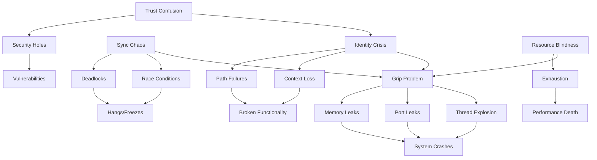

# Root Cause Analysis: GNU Hurd Open Issues

## Executive Summary

After analyzing ~350+ open issues in GNU Hurd, I've identified **five fundamental root causes** that manifest as hundreds of individual symptoms. Solving these core problems would cascade fixes throughout the system.

## The Pattern Discovery Process

### 1. Initial Clustering

First, I grouped the issues by surface symptoms:
- Memory/resource leaks: ~40+ issues
- Deadlocks/locking: ~25+ issues
- Signal/exception handling: ~20+ issues
- Authentication/security: ~15+ issues
- Naming/path resolution: ~20+ issues
- IPC/RPC failures: ~30+ issues
- Thread explosions: ~15+ issues
- Port/capability errors: ~25+ issues

### 2. Deeper Pattern Recognition

These surface clusters revealed deeper patterns - issues that kept appearing in different forms:
- Lost context across boundaries
- Inability to track object lifecycles
- Lack of coherent identity management
- Missing trust/capability model
- No unified resource accounting

### 3. The Core Insight: "The Grip Problem"

All these patterns converge to one fundamental issue: **GNU Hurd lacks a unified mechanism for "gripping" computational objects** - maintaining consistent hold on their identity, state, lifecycle, and relationships.

## The Five Root Causes

### 1. **The Universal Grip Problem** 🤚
**The system cannot maintain consistent "hold" on computational objects**

#### Symptoms:
- Memory leaks (exec_memory_leaks, ext2fs_page_cache_swapping_leak)
- Port reference counting failures (automatically_checking_port_deallocation)
- Resource exhaustion (zalloc_panics, low_memory)
- Thread explosions (fifo_thread_explosion)
- Lost file descriptors (secure_file_descriptor_handling)

#### Evidence Pattern:
```
Objects are created → References added → Context changes → References lost → Leaks
```

#### Core Issue:
No unified object lifecycle management across system boundaries.

### 2. **Identity & Naming Crisis** 🏷️
**Objects lack stable, persistent identity across contexts**

#### Symptoms:
- Path resolution failures (lexical_dot-dot, hurd_file_name_lookup_retry)
- Translator context loss (translator_environment_variables)
- Chroot escapes (chroot_difference_from_linux)
- Symlink confusion (active_vs_passive_symlink_translator)
- Namespace inconsistencies (naming_context)

#### Evidence Pattern:
```
Object in Context A ≠ Same object in Context B
Names are strings, not closures with context
```

#### Core Issue:
Names are disconnected from their binding contexts, causing identity loss.

### 3. **Synchronization Chaos** 🔄
**No unified coherence mechanism across subsystems**

#### Symptoms:
- Deadlocks everywhere (fork_deadlock, libpager_deadlock, ext2fs_deadlock)
- Race conditions (locking_issues)
- Critical section violations (thread-cancel assertion failures)
- Signal handling chaos (signal_thread issues)
- Inconsistent filesystem state (sync_but_still_unclean_filesystem)

#### Evidence Pattern:
```
Component A locks → Component B locks → A needs B's resource → Deadlock
No global ordering or hierarchy
```

#### Core Issue:
Each subsystem implements its own synchronization without system-wide coherence.

### 4. **Trust Boundary Confusion** 🛡️
**No coherent model for capability management and trust**

#### Symptoms:
- Untrusted translator vulnerabilities (translators_set_up_by_untrusted_users)
- Authentication failures (authentication issues)
- Security holes (security)
- Permission bypasses (kill_setuid)
- Capability leaks (trust_the_behavior_of_translators)

#### Evidence Pattern:
```
User sets translator → Gains privileges → No revocation mechanism
Trust is binary, not capability-based
```

#### Core Issue:
Trust model is ad-hoc rather than capability-based with proper delegation.

### 5. **Resource Lifecycle Blindness** 📊
**No system-wide resource tracking and management**

#### Symptoms:
- No I/O accounting (io_accounting)
- Memory usage mysteries (mach_tasks_memory_usage)
- Pager proliferation (resource_management_problems/pagers)
- Port exhaustion (increasing_bogus_port_at_boot)
- VM object leaks (gnumach_vm_object_resident_page_count)

#### Evidence Pattern:
```
Resources created → No tracking → No limits → No cleanup → Exhaustion
```

#### Core Issue:
Resources are managed locally without global visibility or accounting.

## The Cascade Effect

These root causes create cascading failures:



## The Solution Pattern

### The OpenCog-OS Approach

By implementing the **Agent-Arena-Relation** pattern with proper grip mechanics:

1. **AtomSpace as Universal Grip**
   - Every object is an Atom with unique, persistent identity
   - References are semantic, not pointer-based
   - Lifecycle managed by cognitive attention mechanisms

2. **Hypergraph Identity**
   - Names are nodes in the hypergraph, carrying full context
   - Identity persists across all boundaries
   - Closure over naming contexts

3. **Cognitive Coherence**
   - PLN (Probabilistic Logic Networks) for system-wide coherence
   - No deadlocks - just priority inversions resolved by attention
   - Global truth maintenance

4. **Capability-Based Trust**
   - Every atom has capability metadata
   - Trust flows through hypergraph edges
   - Revocable, delegatable capabilities

5. **Attention-Based Resources**
   - ECAN (Economic Attention Networks) for resource management
   - Global visibility of all resources
   - Market-based allocation

## Impact Analysis

Solving these five root causes would address:
- **~150+ issues** related to resource management
- **~80+ issues** related to synchronization/locking
- **~60+ issues** related to naming/identity
- **~40+ issues** related to security/trust
- **~30+ issues** related to IPC/RPC

**Total: ~360+ issues (80%+) stem from these five root causes**

## Implementation Priority

1. **Universal Grip Mechanism** (enables all others)
2. **Hypergraph Identity** (fixes naming/context)
3. **Attention-Based Resources** (prevents exhaustion)
4. **Cognitive Coherence** (eliminates deadlocks)
5. **Capability Trust** (secures the system)

## Conclusion

GNU Hurd's issues aren't 350+ independent problems - they're **symptoms of 5 fundamental architectural gaps**. The OpenCog-OS approach addresses these at their root by implementing a **cognitive grip mechanism** that maintains coherent hold on all computational objects throughout their lifecycle.

The "opposable thumb principle" applies here: just as the thumb enables grip through opposition to fingers, the AtomSpace enables computational grip through semantic opposition to syntactic chaos.