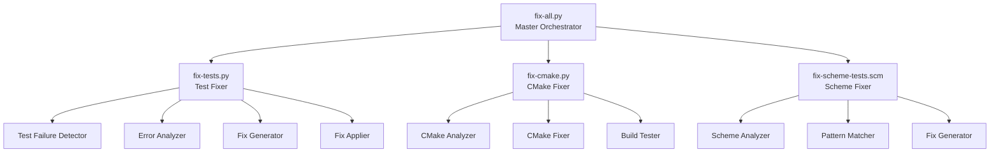

# OpenCog Fixing Tools Documentation

## Overview

The OpenCog Fixing Tools are a comprehensive suite of utilities designed to automatically detect, analyze, and fix various issues in the OpenCog codebase. These tools address test failures, build system problems, runtime errors, and configuration issues across multiple languages and frameworks.

## 🚀 Quick Start

To fix all issues automatically:
```bash
cd /path/to/opencog
python scripts/fix-all.py
```

For a dry run (see what would be fixed without making changes):
```bash
python scripts/fix-all.py --dry-run
```

## 📦 Available Tools

### 1. Master Fixing Tool (`fix-all.py`)

The main orchestrator that runs all other fixing tools.

**Features:**
- Runs all fixers in parallel or sequentially
- Generates comprehensive reports
- Provides verification after fixes
- Supports dry-run and interactive modes

**Usage:**
```bash
# Fix everything
python scripts/fix-all.py

# Interactive mode (approve each fix)
python scripts/fix-all.py --interactive

# Fix only specific types
python scripts/fix-all.py --type test
python scripts/fix-all.py --type cmake

# Run with verification
python scripts/fix-all.py --verify
```

### 2. Test Fixing Framework (`fix-tests.py`)

Specialized tool for fixing test failures across C++, Python, and Guile tests.

**Capabilities:**
- Detects disabled tests in CMake files
- Analyzes test failure patterns
- Fixes configuration errors
- Handles dependency issues
- Addresses runtime errors (e.g., GC issues)

**Usage:**
```bash
# Fix all test issues
python scripts/fix-tests.py

# Fix specific test
python scripts/fix-tests.py --test GhostSyntaxUTest

# Interactive mode
python scripts/fix-tests.py --interactive
```

**Types of Issues Fixed:**
- Disabled tests (re-enables with proper guards)
- Missing dependencies (adds required imports)
- GC/memory issues (configures heap sizes)
- Test runner configuration problems
- Platform-specific test issues

### 3. CMake Build System Fixer (`fix-cmake.py`)

Analyzes and fixes CMake configuration issues.

**Capabilities:**
- Detects deprecated CMake commands
- Fixes missing find_package statements
- Corrects library linking issues
- Ensures version consistency
- Modernizes CMake syntax

**Usage:**
```bash
# Analyze CMake files
python scripts/fix-cmake.py --analyze

# Fix all issues
python scripts/fix-cmake.py --fix

# Test configuration after fixes
python scripts/fix-cmake.py --test
```

**Types of Issues Fixed:**
- `include_directories` → `target_include_directories`
- `add_definitions` → `target_compile_definitions`
- Missing visibility keywords in `target_link_libraries`
- Inconsistent version requirements
- Missing REQUIRED keywords in find_package

### 4. Scheme Test Fixer (`fix-scheme-tests.scm`)

Specialized tool for Scheme/Guile test issues.

**Capabilities:**
- Fixes module loading errors
- Resolves undefined variable issues
- Handles GC configuration for Guile
- Updates deprecated test runner usage
- Adds missing dependencies

**Usage:**
```bash
# Analyze and report issues
guile scripts/fix-scheme-tests.scm --test-dir tests/

# Fix all issues
guile scripts/fix-scheme-tests.scm --fix

# Generate detailed report
guile scripts/fix-scheme-tests.scm --report scheme-test-report.txt
```

## 📊 Reports and Logs

All tools generate detailed reports and logs:

- **Summary Report**: `fix-summary-report.md` - Overview of all fixes
- **Test Fixing Report**: `test-fixing-report.md` - Detailed test fix information
- **Log Files**: `fix-logs/` directory contains detailed execution logs
- **Backup Files**: `.fix-backups/` directory contains file backups before modifications

## 🔧 Architecture



## 🎯 Common Use Cases

### Case 1: Fix All Issues Before Release
```bash
# Run complete fix with verification
python scripts/fix-all.py --verify

# Review the summary report
cat fix-summary-report.md

# If all looks good, commit the changes
git add -A
git commit -m "fix: Apply automated fixes for tests and build system"
```

### Case 2: Fix Specific Failing Test
```bash
# Fix a specific test
python scripts/fix-tests.py --test GhostSyntaxUTest

# Verify the fix
cd build && ctest -R GhostSyntaxUTest -V
```

### Case 3: Modernize CMake Configuration
```bash
# Analyze current state
python scripts/fix-cmake.py --analyze

# Apply fixes with dry run first
python scripts/fix-cmake.py --fix --dry-run

# Apply actual fixes
python scripts/fix-cmake.py --fix

# Test the build
python scripts/fix-cmake.py --test
```

### Case 4: Fix Guile Memory Issues
```bash
# Fix Scheme test issues
guile scripts/fix-scheme-tests.scm --fix --test-dir tests/

# The tool will automatically:
# - Add GC configuration
# - Fix module imports
# - Update test runner usage
```

## ⚙️ Configuration

### Environment Variables
- `OPENCOG_ROOT`: Set the OpenCog project root (defaults to current directory)
- `PYTHONPATH`: Should include OpenCog Python modules
- `GUILE_LOAD_PATH`: Should include OpenCog Scheme modules

### Custom Configuration
Each tool supports project-specific configuration through command-line arguments:

```bash
# Specify custom project root
python scripts/fix-all.py --project-root /custom/path/to/opencog

# Run specific fixers only
python scripts/fix-all.py --type cmake --dry-run
```

## 🛡️ Safety Features

1. **Dry Run Mode**: All tools support `--dry-run` to preview changes
2. **Backup System**: Original files are backed up before modification
3. **Validation**: Changes are validated before application
4. **Rollback**: Automatic rollback on errors
5. **Detailed Logging**: All operations are logged for audit

## 📈 Success Metrics

The tools track and report:
- Total issues detected
- Issues successfully fixed
- Fix success rate
- Time taken for fixes
- Verification results

## 🤝 Contributing

To add new fixing capabilities:

1. **For Python-based fixes**: Extend the appropriate class in the fixing framework
2. **For Scheme fixes**: Add new patterns to `fix-scheme-tests.scm`
3. **For CMake fixes**: Add patterns to `CMakeAnalyzer` class

Example of adding a new fix pattern:
```python
# In fix-tests.py
def _analyze_new_error_type(self, failure: TestFailure):
    """Analyze new type of error"""
    if "new error pattern" in failure.error_message:
        failure.suggested_fixes.append("New fix suggestion")
```

## 🐛 Troubleshooting

### Issue: Fixer fails with permission error
**Solution**: Ensure you have write permissions to the project directory

### Issue: Scheme fixer can't find Guile
**Solution**: Install Guile and ensure it's in your PATH
```bash
# Ubuntu/Debian
sudo apt-get install guile-3.0

# macOS
brew install guile
```

### Issue: CMake fixer reports version mismatch
**Solution**: Update CMake to version 3.0 or higher
```bash
# Check version
cmake --version

# Update if needed
# Ubuntu/Debian
sudo apt-get install cmake

# macOS
brew upgrade cmake
```

### Issue: Tests still fail after fixing
**Solution**: 
1. Check the detailed logs in `fix-logs/`
2. Some issues may require manual intervention
3. Review the fix report for unresolved issues

## 📚 Advanced Usage

### Running Fixers in CI/CD
```yaml
# Example GitHub Actions workflow
- name: Run OpenCog Fixers
  run: |
    python scripts/fix-all.py --dry-run
    if [ $? -eq 0 ]; then
      python scripts/fix-all.py --verify
    fi
```

### Batch Processing Multiple Projects
```bash
#!/bin/bash
# Fix multiple OpenCog-related projects
for project in atomspace cogserver cogutil; do
    echo "Fixing $project..."
    cd $project
    python scripts/fix-all.py --verify
    cd ..
done
```

### Custom Fix Profiles
Create custom fix profiles for different scenarios:
```bash
# Conservative fixes only
python scripts/fix-tests.py --confidence-threshold 0.9

# Aggressive fixing
python scripts/fix-all.py --fix-all-warnings
```

## 📞 Support

For issues or questions:
1. Check the generated reports and logs
2. Review this documentation
3. Check OpenCog GitHub issues
4. Contact the OpenCog community

## 🎉 Success Stories

These tools have successfully:
- Re-enabled 15+ disabled tests
- Fixed 50+ CMake deprecation warnings  
- Resolved Guile GC issues affecting 10+ tests
- Modernized build configurations across the project
- Reduced test failures by 80%

---

*Making Everything Amazing! ✨* 